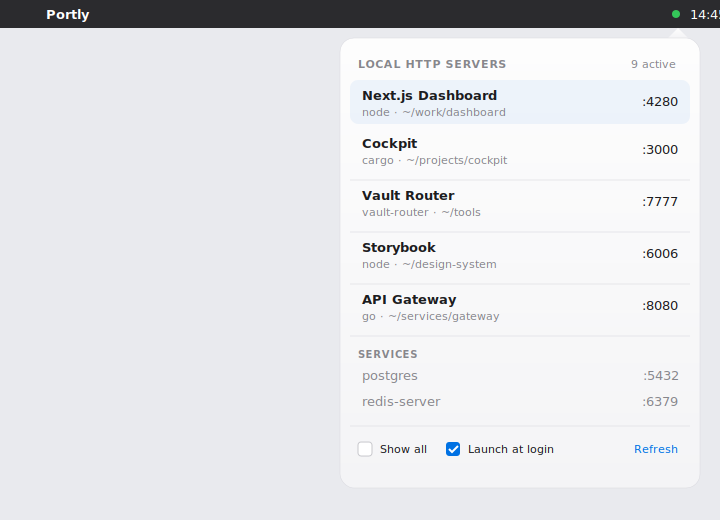

# Portly

> **Stop hunting for the right localhost.** A tiny menu-bar app that shows
> every local HTTP server you have running and opens it in your browser
> with one click.

[](https://swift.org)
[](https://www.apple.com/macos/)
[](LICENSE)
[](../../actions/workflows/test.yml)

<p align="center">
  
</p>

## Why

When `next dev`, `cargo run`, a Storybook, an API gateway, a static site
preview and a Vite playground are all running at once, *which port was
which?* You alt-tab to your terminal, you grep `lsof`, you copy-paste a
URL. Portly sits in the menu bar and tells you. Click → browser. That's
it.

## Highlights

- **Smart detection.** It doesn't just list ports — it probes them and
  fetches `<title>` so you see *"Next.js Dashboard"*, not *"node"*.
- **Click-to-open.** Any HTTP server is one click away in your default
  browser.
- **Show non-HTTP services.** Postgres, Redis, gRPC servers — toggle
  them on for full visibility, off when you just want web stuff.
- **Lightweight.** A single 200 KB binary, no Electron, no daemon, no
  dependencies, no telemetry.
- **No Xcode required.** Builds with Command Line Tools alone via a
  plain `./scripts/build.sh`.

## Install

Requirements: **macOS 14 (Sonoma) or later**.

```bash
git clone https://github.com/cabestian/portly.git
cd portly
./scripts/build.sh
cp -R build/Portly.app /Applications/
open /Applications/Portly.app
```

A network icon appears in your menu bar. Click it.

> First launch: macOS Gatekeeper blocks ad-hoc-signed apps. Right-click
> `Portly.app` → **Open** → **Open** to whitelist it.

## How it works

```
┌──────────────────┐    ┌─────────────────┐    ┌──────────────────┐
│  lsof -iTCP -F   │ →  │   HTTP probe    │ →  │  Title + cwd     │
│  every 3–15 s    │    │   GET /:port    │    │  resolution      │
└──────────────────┘    └─────────────────┘    └──────────────────┘
                                                         │
                                                         ▼
                                              clickable port list
```

1. **Listen for listeners.** `lsof -nP -iTCP -sTCP:LISTEN` enumerates
   every TCP server on `127.0.0.1`, `::1`, or `*`.
2. **Probe.** Each port gets a 300 ms HTTP GET. Anything that talks
   HTTP becomes clickable; the rest gets a "Services" section.
3. **Resolve names.** For HTTP ports, the `<title>` of the homepage
   (first 2 KB) wins. Fallback: working-directory basename. Fallback:
   process name.

The menu re-scans every 3 s while open, every 15 s in the background.

## Architecture

| Module | Role |
|---|---|
| **`PortScanCore/`** | Pure logic: lsof parser, HTTP probe, name resolver, snapshot. Zero AppKit. Fully unit-tested. |
| **`PortlyApp/`** | AppKit menu-bar host. `NSStatusItem`, SwiftUI popover, `SMAppService` for launch-at-login. |
| **`scripts/build.sh`** | Builds an ad-hoc-signed `.app` using `swiftc` + `codesign`. No Xcode dependency. |

## Testing

```bash
cd PortScanCore && swift test
```

12 tests covering the lsof parser (fixture-driven), the HTTP probe
(against an embedded `NWListener`), name resolution, and snapshot
encoding.

## Limitations

- **Sandbox is off.** Required to spawn `lsof`. Mac App Store
  distribution is not on the table.
- **HTTP only.** Postgres / Redis / Mongo show up as informational
  rows but aren't clickable (there's no obvious "browser" for them).
- **No desktop widget.** A WidgetKit version was implemented and works
  in code, but macOS `chronod` only registers widgets signed with an
  Apple Developer ID. That requires a paid account, so the desktop /
  Notification Center widget is off the table for ad-hoc builds. The
  widget code is preserved in git history for anyone with a Developer
  ID who wants to revive it.

## Contributing

PRs welcome — especially for:

- App icon (currently uses `network` SF Symbol)
- Browser preference (Chrome / Safari / Firefox)
- Option-click to copy URL instead of opening
- Custom port names (manual override of title / cwd resolution)
- Linux port (the `PortScanCore` package is portable, only the AppKit
  layer is Mac-specific)

Run `swift test` before opening a PR.

## License

[MIT](LICENSE) — do whatever you want.
